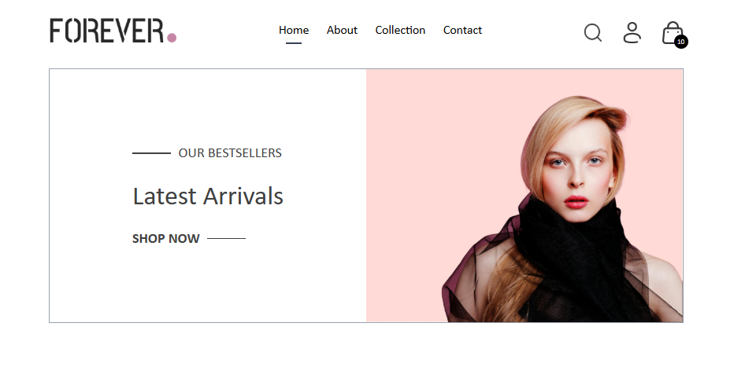
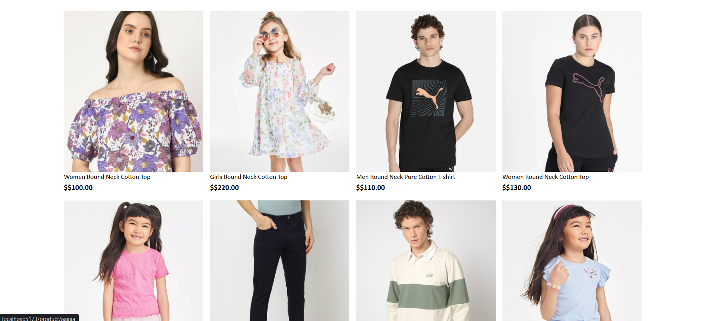

# 🛍️ Forever - E-Commerce Website

A modern and responsive e-commerce website built using **React.js** and **Vite**.

The project provides a clean shopping experience with product collections, product details, cart functionality, and responsive navigation.

## 🚀 Live Demo

Coming soon...

## 📌 Features

- 🏠 Responsive Home Page
- 🛍️ Product Collections
- 🔍 Product Search
- 📦 Product Details
- 🛒 Shopping Cart
- 👤 User Profile Navigation
- 📱 Fully Responsive Design
- 🧭 Navigation using React Router
- 🎨 Modern UI using Tailwind CSS
- ⚡ Fast development using Vite

## 🛠️ Technologies Used

- **React.js**
- **Vite**
- **Tailwind CSS**
- **React Router DOM**
- **JavaScript (ES6+)**
- **HTML5**
- **CSS3**

## 📸 Screenshot

### Home Page




## 📂 Project Structure

```text
website-frontend/
│
├── public/
│
├── src/
│   ├── assets/
│   │   └── frontend_assets/
│   │
│   ├── components/
│   │
│   ├── pages/
│   │
│   ├── context/
│   │
│   ├── App.jsx
│   └── main.jsx
│
├── screenshots/
│   └── image.png
│
├── .gitignore
├── index.html
├── package.json
├── package-lock.json
├── vite.config.js
└── README.md


